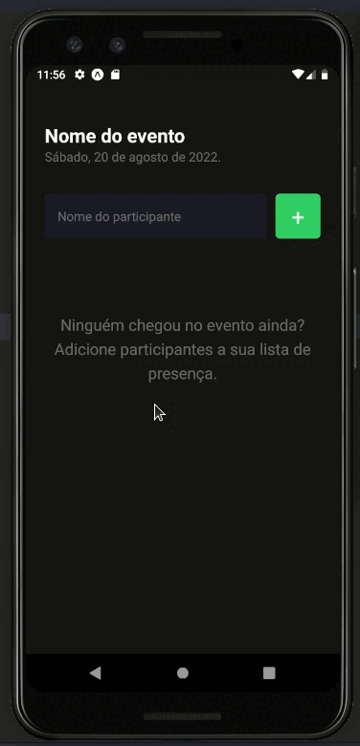

<div align="center">
  <h1>App ImHere</h1>
</div>

### :hammer: About the application

In this application we create a guest list for events, with the function of adding and removing with React Native using Expo Manager Workflow and we learn about the most important concepts of React and React Native, among them are componentization, states, immutability, hooks, and how React Native renders native interfaces. In addition to applying Typescript in the project to add static typing to the application.

</br>
</br>
<div align="center">
  
</div>
</br>
</br>

### :rocket: Technologies

- React Native (Expo)
- Typescript

### :arrow_heading_down: How to install the project and run

[configure your development environment](https://react-native.rocketseat.dev/)

```bash
  # clone the project
  git clone https://github.com/mauriciogirardi/app-imhere.git

  # install dependencies
  npm i

  # run the project
  npm run start
```

---

Feito com :heart: by [Mauricio Girardi](https://www.linkedin.com/in/mauricio-girardi)
